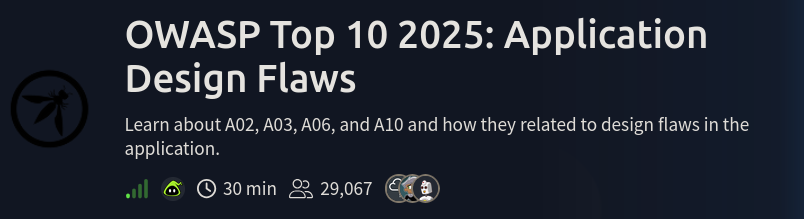

This room breaks each 4 of the OWASP Top 10 2025 categories. In this room, you will learn about the categories that are related to failures in architecture and system design. You will put the theory into practice by completing supporting challenges. The following categories are covered in this room:

AS02: Security Misconfigurations

AS03: Software Supply Chain Failures

AS04: Cryptographic Failures

AS06: Insecure Design

# SECURITY Misconfigurations (AS02)

Security Misconfigurations ofen occurs due to :

1)Default credentials or weak passwords left unchanged

2)Unnecessary services or endpoints exposed to the internet

3)Misconfigured cloud storage or permissions (S3, Azure Blob, GCPbuckets)

4)Unrestricted API access or missing authentication/authorisation

5)Verbose error messages exposing stack traces or system details

6)Outdated software, frameworks, or containers with known vulnerabilities

7)Exposed AI/ML endpoints without proper access controls

Lets solve the challenge 

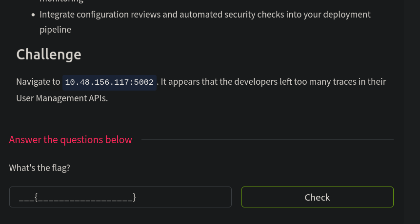

lets visit the site 

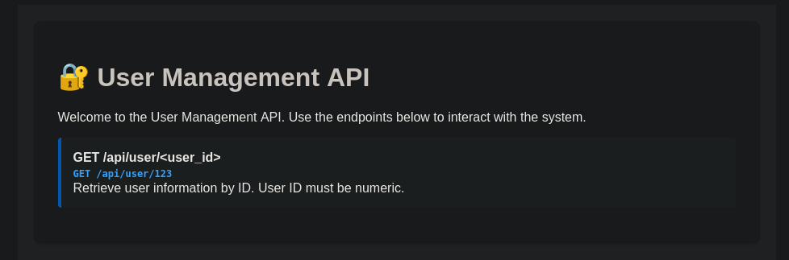

We got an api endpoint , lets test that in burp

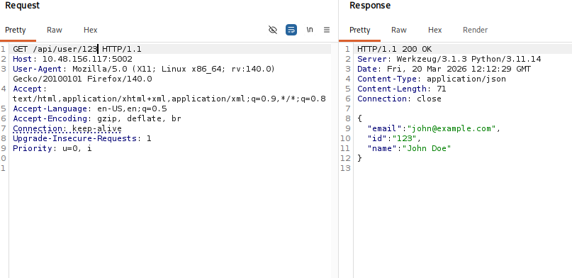

changing the userid to 0,1,5,10,124,110 but we are getting the same result 

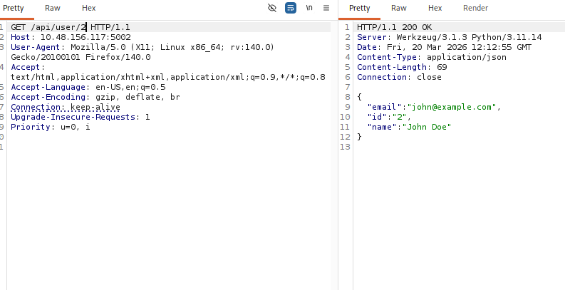

In the site they mentioned userID should be numeric , lets try a non-numeric-value value 

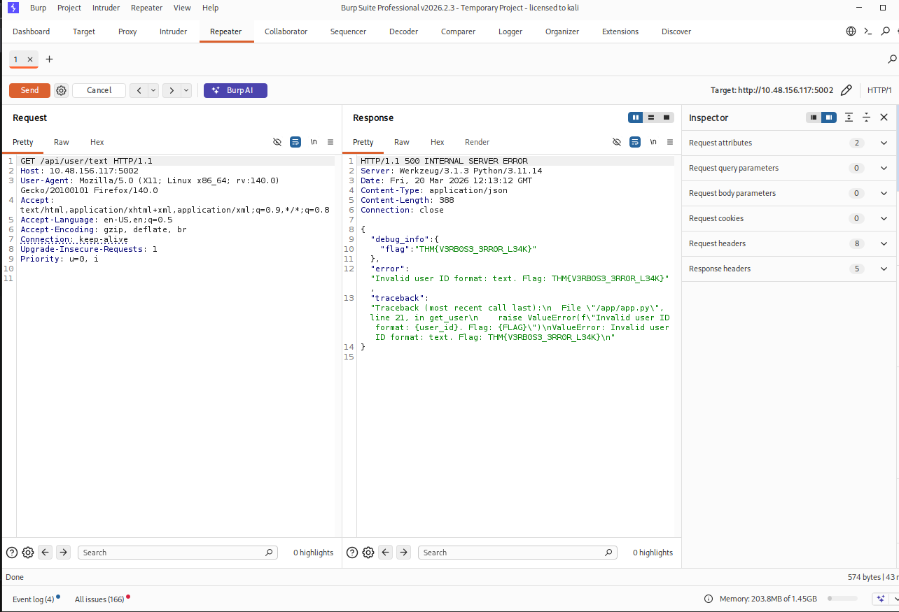

In ERROR MESSAGE WE FOUND THE FLAG --> This is mishanding of error messages like leaking sensisive information in the error messages 

# SOFTWARE SUPPLY CHAIN FAILURES (AS03)

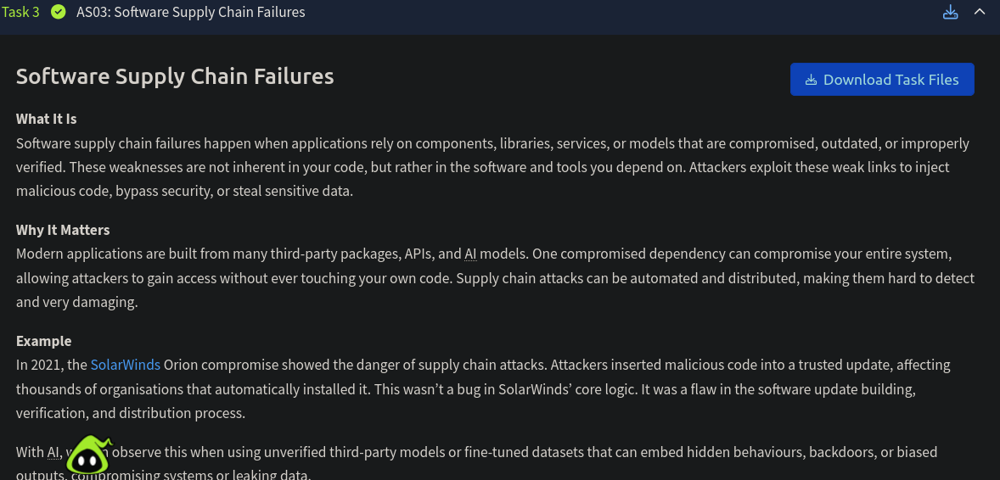

Challenge:

Navigate to MACHINE_IP:5003. The code is outdated and imports an old lib/vulnerable_utils.py component. Can you debug it?

Lets visit the site 

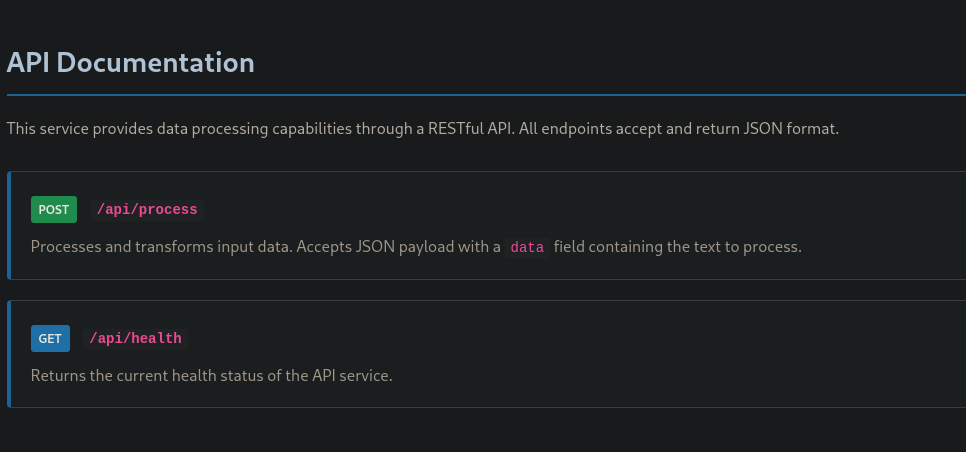

There are two api endpoints , lets analyze them both in burp 

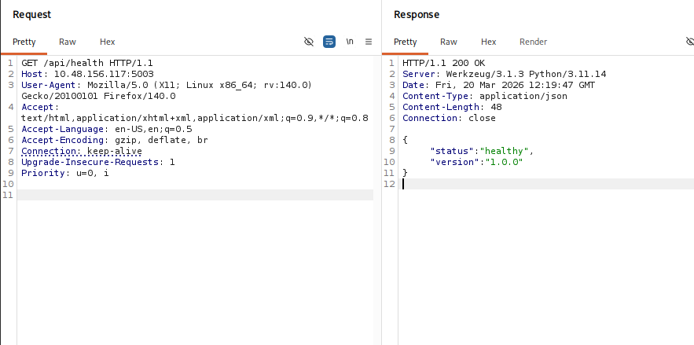

Seems like api/health shows us the status of the current site or server , lets analyze api/process

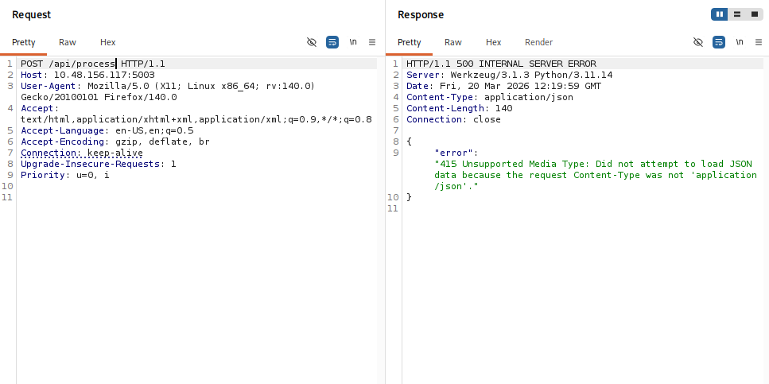

api/process requires an data to be passed in the json format , lets analyze the python code we downloded 

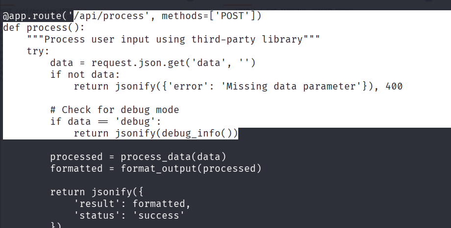

we found that /api/process requires an data value to be debug which has be to passed in json format , which calls a function debug_info() which may revels us the flag 

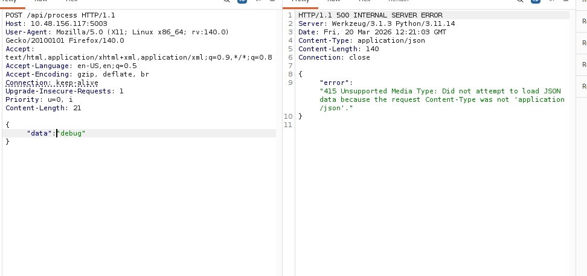

add the header content-type 

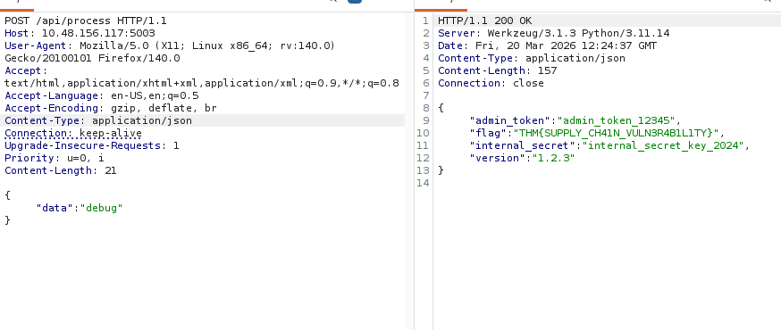

We successfully found the flag 

# CRYTOGRAPIC FAILURES (AS04)

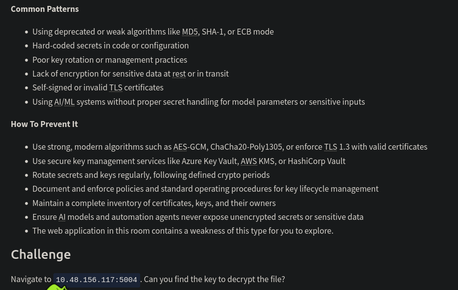

Challenge:

Navigate to MACHINE_IP:5004. Can you find the key to decrypt the file?

lets visit the site 

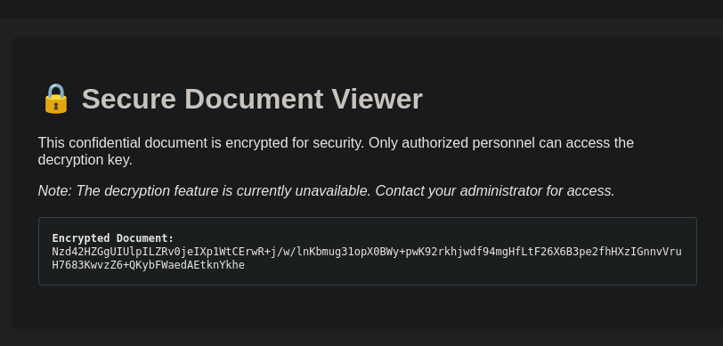

We found an encrypted meassage 

lets visit the source code of the page 

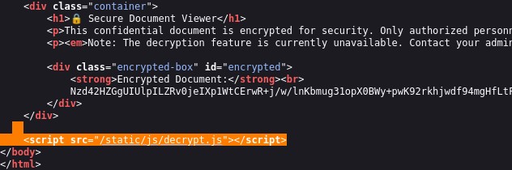

There is a file called decrypt.js , lets visit the file 

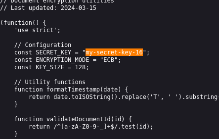

found the secret key and the algorithm used to encrypt the meassage , lets decode it 

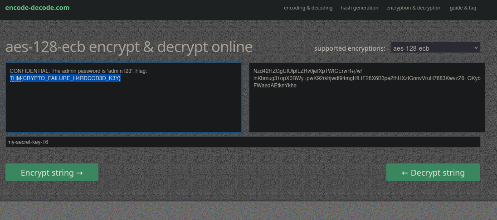

We successfully found the flag 

# INSECURE DESIGN (AS06)

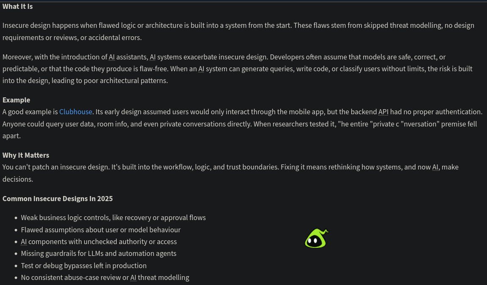

Challenge:

Navigate to MACHINE_IP:5005. Have they assumed that only mobile devices can access it?

lets visit the site 

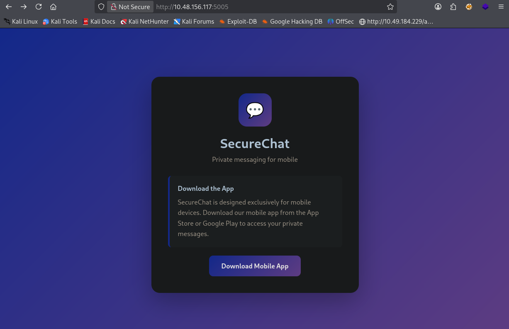

no features seems to be working , so lets try some common api endpoints 

Example:

1)api/users/

2)api/messages/

3)api/messages/users

4)api/users/messages

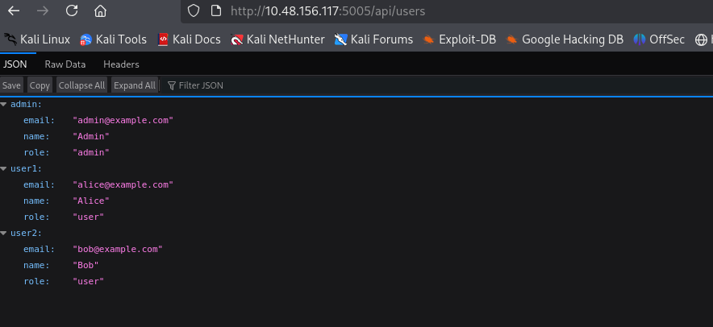

we found the user 

lets try to access their messages 

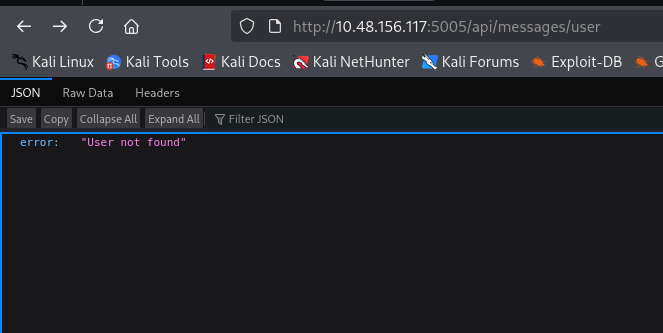

lets try user1

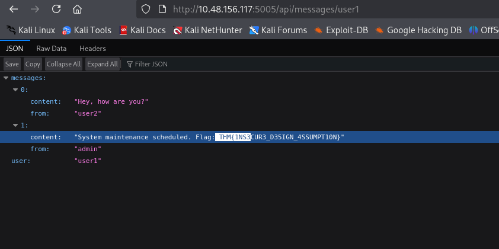

We successfully found the flag 

# CONCLUSION:

This lab gives a basic overview and pratical Experience of owasp top 10 2025 vulnerabilities which affects security design :

 1)AS02 Security Misconfigurations
 
 2)AS03 Software Supply Chain Failures
 
 3)AS04 Cryptographic Failures
 
 4)AS06 Insecure Design 
