## OWASP TOP 10 2025

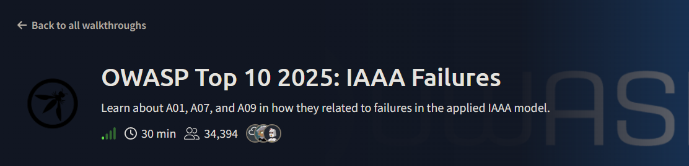

The first phase of the Room basic idea of identification , Authentication , Authorization and Accountability 

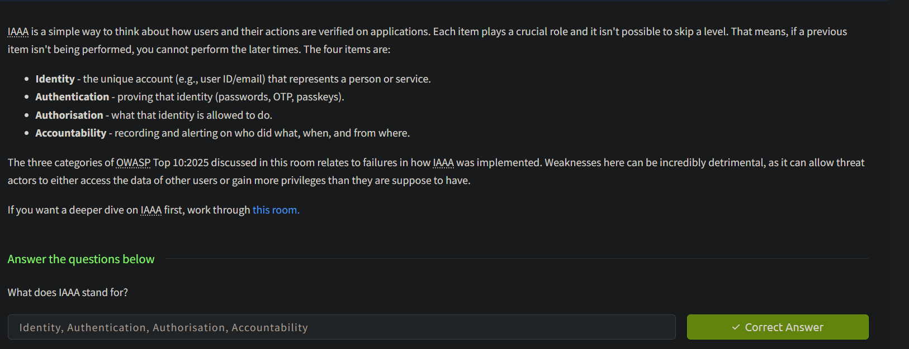

## BROKEN ACCESS CONTROL 

We have a site to test for broken access control lets click on view site 

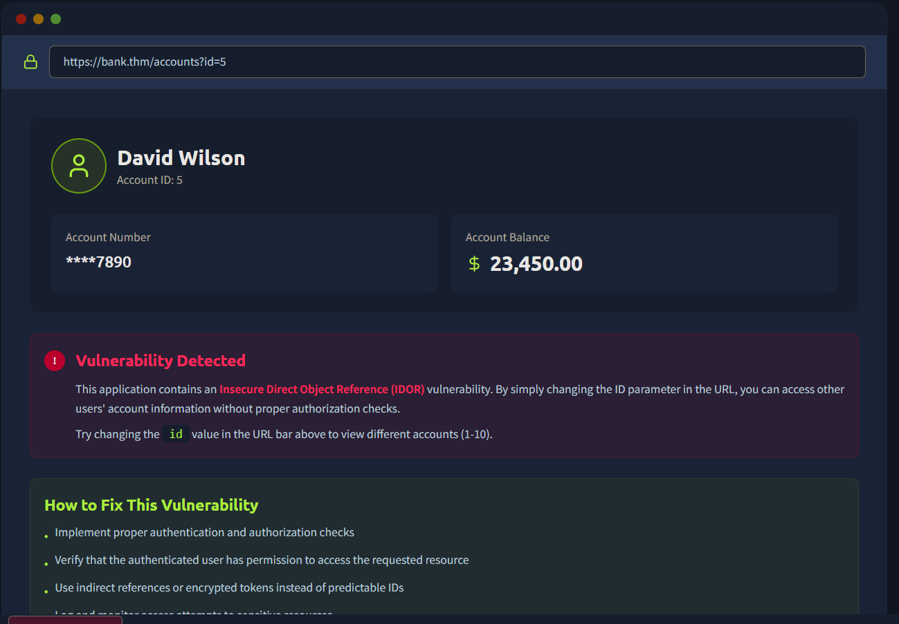

In the url parameter we can notice the id parameter which value is initially 5 

?id=5 

lets change it to 6 and we got another users profile detail 

lets change it to 7 , we found the flag 

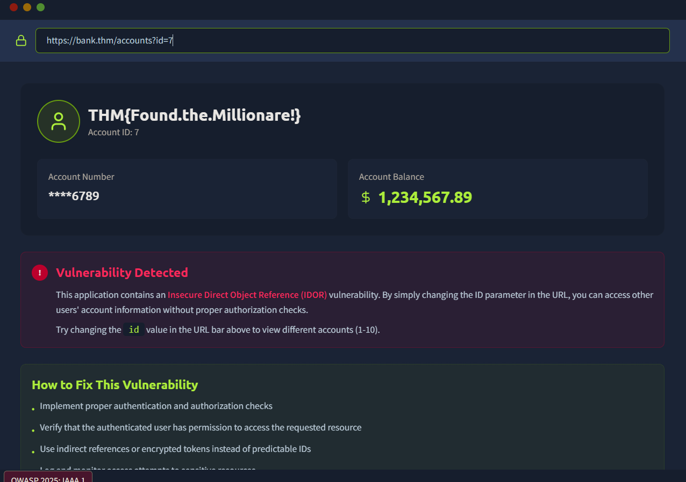

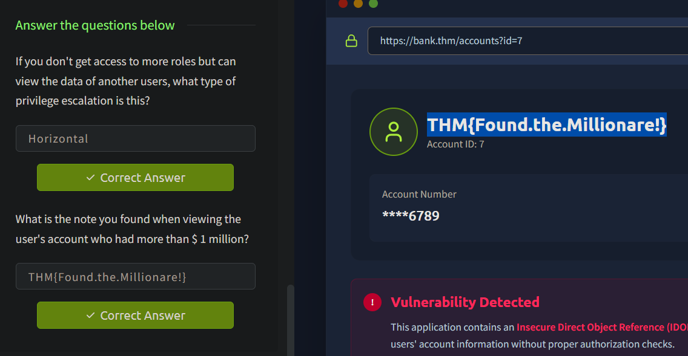

## AUTHENTICATION FAILURES 

We have a site to test for Authentication Failures lets click on view site

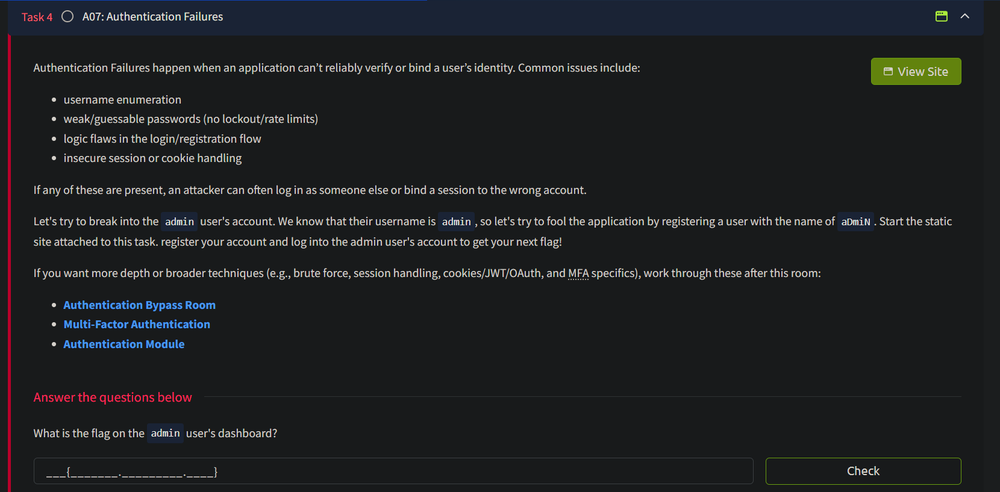

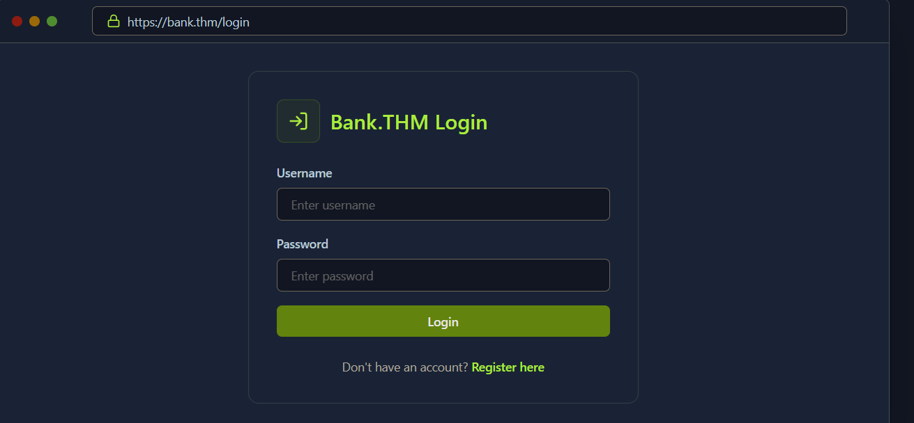

Initially we have given a login page , lets try the default credentials 

username: admin
password: admin 

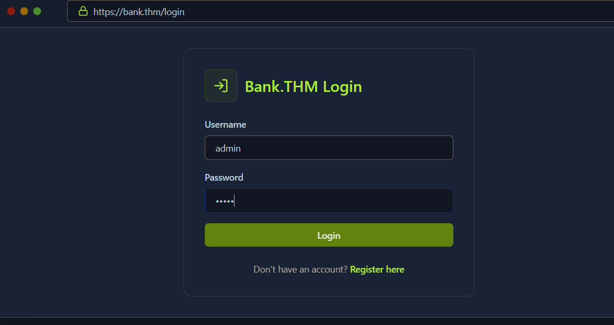

invalid credentials unable to login , lets try to register with username admin

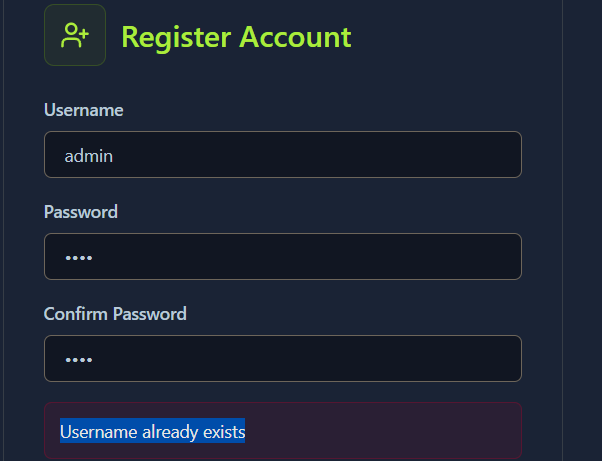

we found that admin user exists , lets create a account with 

username : aDmiN  --> this might give us a admin privilege since server might treat admin and aDmiN as same 

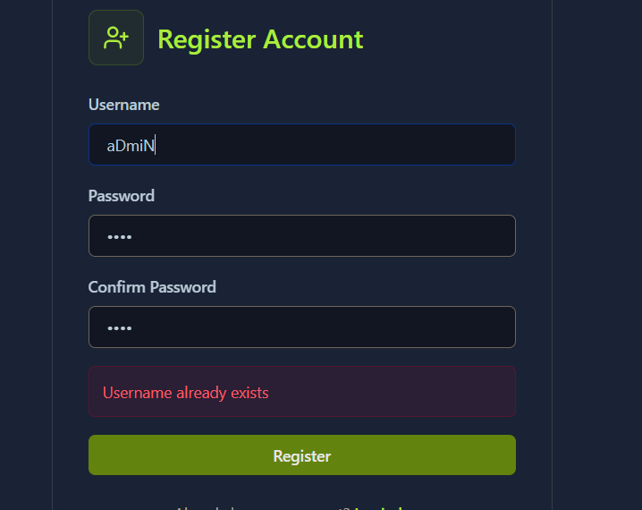

register andlogn and we got admin privilege as well the flag 

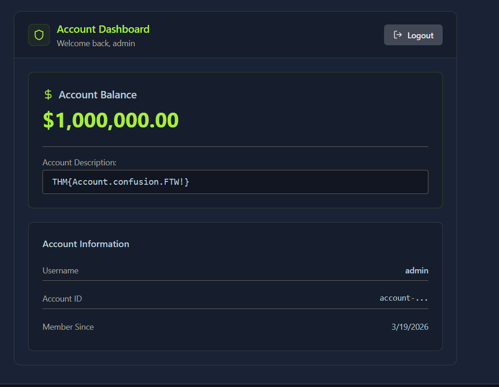

## LOGGING & ALERTING FAILURES

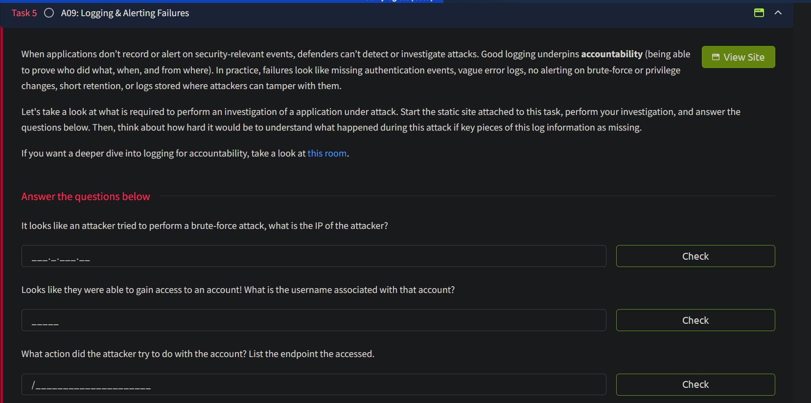

We have given a SIEM Dashboard to understand Logging and Alerting Failures , click on view site  

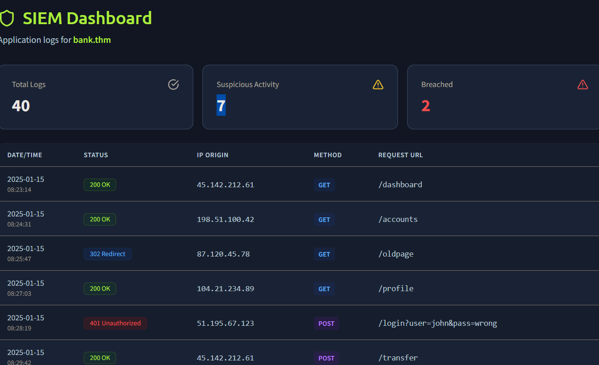

lets analyze the siem dashboard

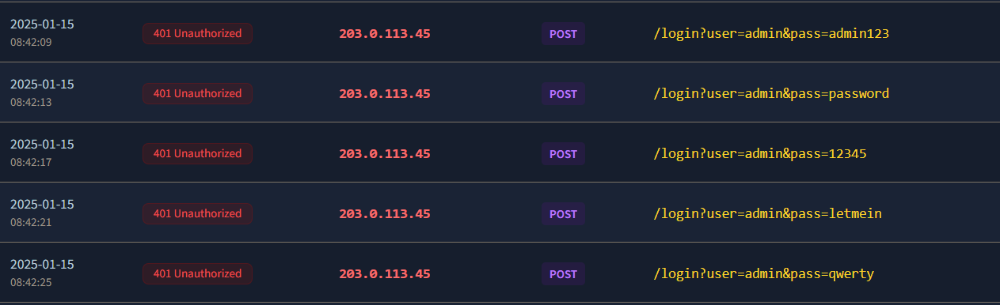

looks like a attacker trying different combinations of password with username admin to login , 203.0.113.45 is the attacker ip

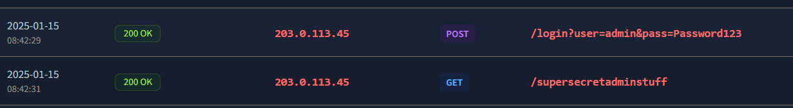

seems like the attacker sussfully loged in as admin with password Password123

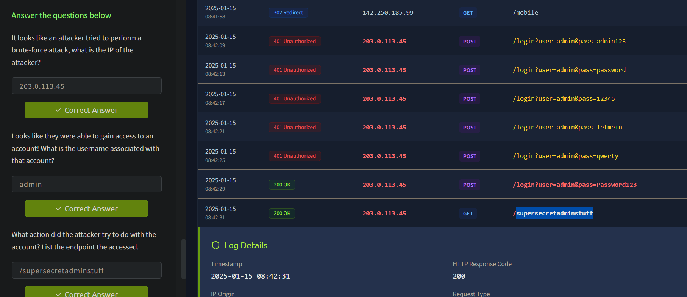

## CONCLUSION 

This lab demonstrate a basic idea of :

--> Broken Access Control (A:01)
--> Authentication Failures (A:07)
--> security Logging or Monitoring Failures (A:09)

With an pratical example 

